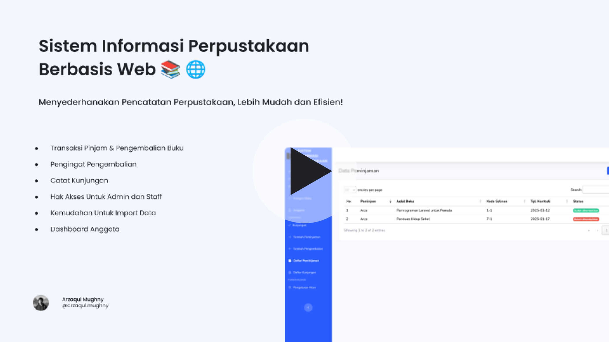

# Aplikasi Sistem Informasi Perpustakaan

[](https://www.youtube.com/watch?v=bHVeRVFA5MI)

## Latar Belakang

Pada perpustakaan biasanya pengunjung akan meminjam buku, namun petugas perpustakaan perlu mencatatnya agar dapat ditelusuri, Namun hal itu sangat tidak efisien apabila perpustakaan memiliki pengunjung yang banyak. Petugas perlu mencatat keseluruhan transaksi, serta akan kesulitan dalam melacak lokasi buku.

Saya mencoba memberikan solusi atas masalah-masalah tersebut. Dengan aplikasi ini petugas tidak perlu lagi mencatat transaksi secara manual, serta akan memudahkan dalam mengetahui lokasi buku, apakah buku ini sudah dikembalikan? buku ini sedang dipinjam oleh siapa?.

> Pada aplikasi ini saya juga belajar untuk menjadi seorang analis sistem yang berfokus pada solusi yang diberikan. **Saya menyadari bahwa kemampuan teknis (coding) saja tidak cukup dalam menyelesaikan masalah**, memahami alur bisnis itu lebih penting, Karena akan memudahkan kita nantinya pada saat implementasi.

## Solusi dan Fitur Aplikasi


Saya memberikan solusi untuk mencatat transaksi pinjam-pengembalian dapat dilakukan dengan mudah. Pengguna hanya perlu mengisi anggota, buku, dan tanggal pengembalian. Nantinya daftar peminjaman dapat dilihat dengan mudah beserta dengan status pengembaliannya.

### Fitur Lain

-   Pengingat Pengembalian
-   Catat Kunjungan
-   Hak Akses Untuk Admin dan Staff
-   Kemudahan Untuk Import Data
-   Dashboard Anggota

## Demo

Untuk demo saya buatkan melalui video yang dapat anda putar diatas

## Source Code

-   Aplikasi ini dapat anda gunakan dengan gratis
-   Project / aplikasi ini terbuka bagi siapapun yang ingin berkontribusi.

## Petunjuk Instalasi

### Development

```
cp .env.example .env // lalu sesuaikan pengaturan database
php artisan key:generate
php artisan storage:link
php artisan migrate:fresh --seed
php artisan serve
```

### Production

```
...
```
